# DNY - Dynamic Domain Name for You
## Presentation Charts & Diagrams

---

## 1. SYSTEM ARCHITECTURE CHARTS

### 1.1 Connecting to Computer (Finding Free Network Cards)

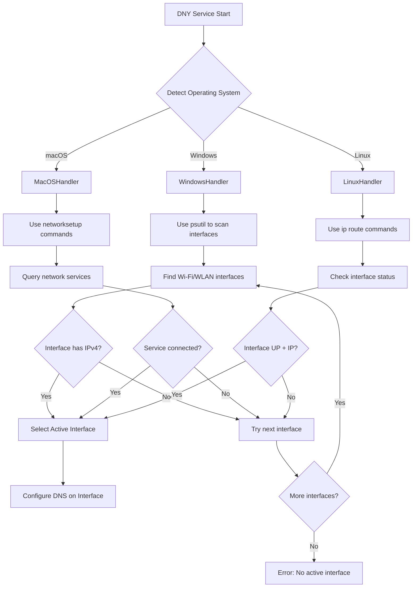

**Key Components:**
- **Cross-platform detection**: Windows (psutil), macOS (networksetup), Linux (ip commands)
- **Interface validation**: IPv4 address presence, UP status, connectivity
- **Automatic selection**: First available active interface

---

### 1.2 Automatic Disconnection & Restoration

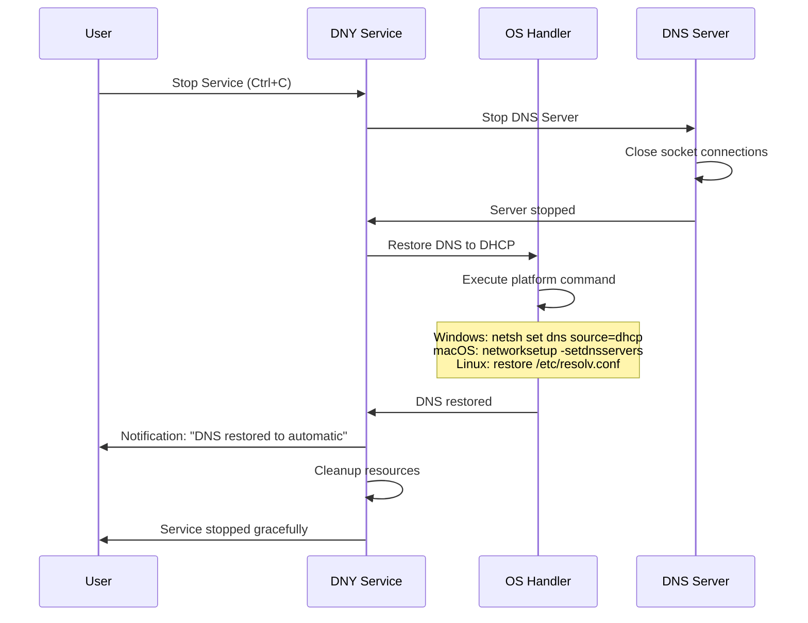

---

### 1.3 Finding DNS Server

```mermaid
flowchart LR
    A[Start DNS Detection] --> B{Operating System}
    
    B -->|Windows| C[ipconfig /all]
    B -->|macOS| D[scutil --dns + /etc/resolv.conf]
    B -->|Linux| E[/etc/resolv.conf]
    
    C --> F[Parse DNS Servers regex]
    D --> G[Extract nameserver entries]
    E --> H[Read nameserver lines]
    
    F --> I{DNS = 127.0.0.1?}
    G --> J[Primary DNS Found]
    H --> J
    
    I -->|Yes| K[Restore DHCP & Retry]
    I -->|No| J
    
    K --> C
    J --> L[Store as Primary DNS]
    L --> M[Set Fallback: 8.8.8.8]
    
    M --> N[DNS Configuration Complete]
    
    style J fill:#90EE90
    style N fill:#87CEEB
```

---

### 1.4 Creating Service Architecture

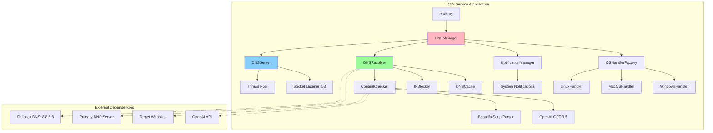

---

### 1.5 Server Operation Flow

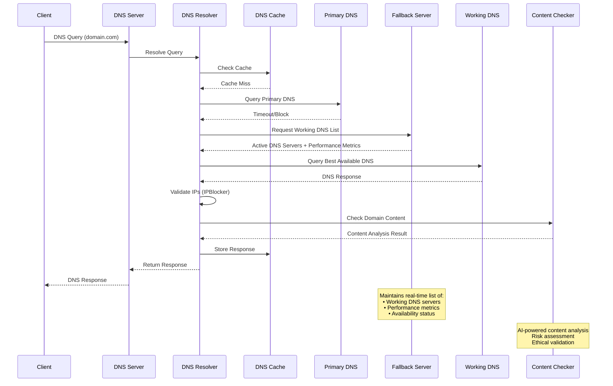

---

### 1.6 Cache System Architecture

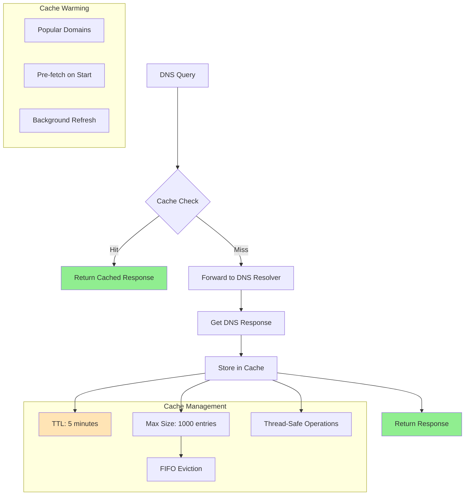

---

### 1.7 Block Detection Mechanism

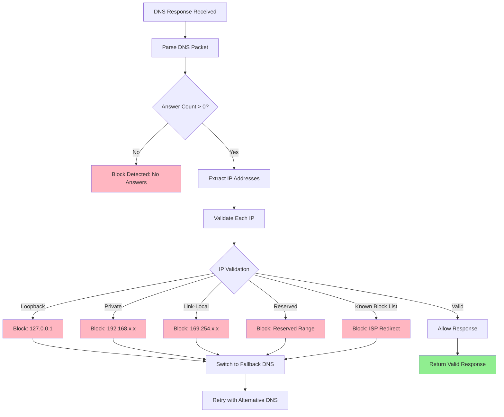

---

### 1.8 Block Resolution Process

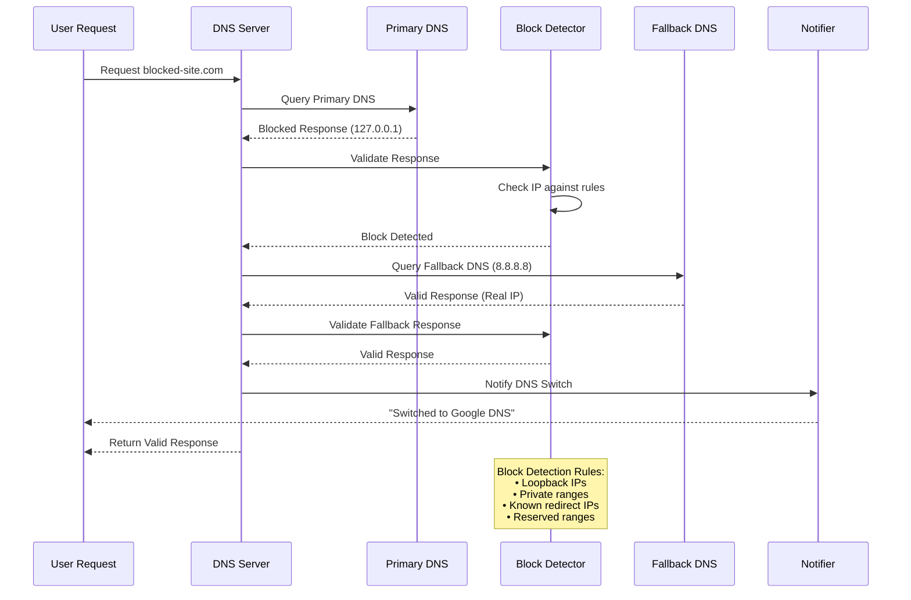

---

### 1.9 AI Content Analysis

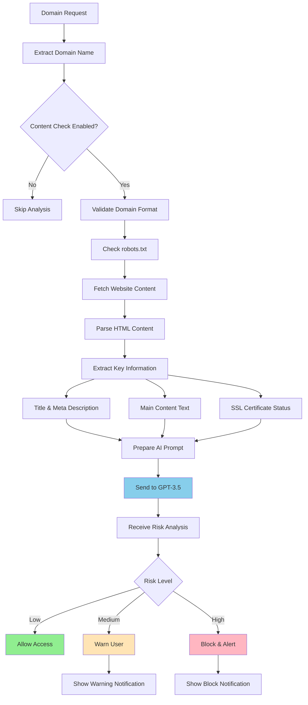

---

### 1.10 Notification System

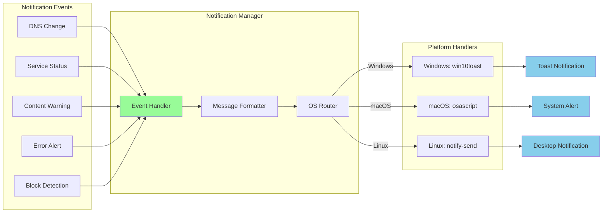

---

## 2. SUPER ARCHITECTURE CHART

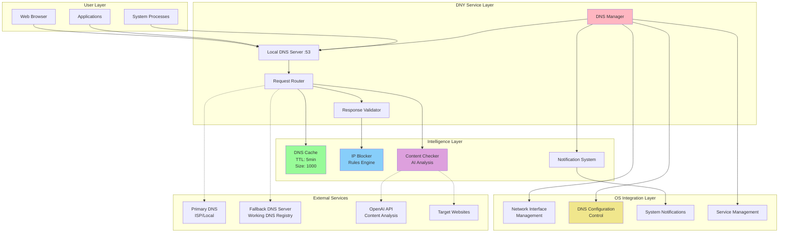

---

## 3. ROBUSTNESS FEATURES

### 3.1 DNS Server Robustness

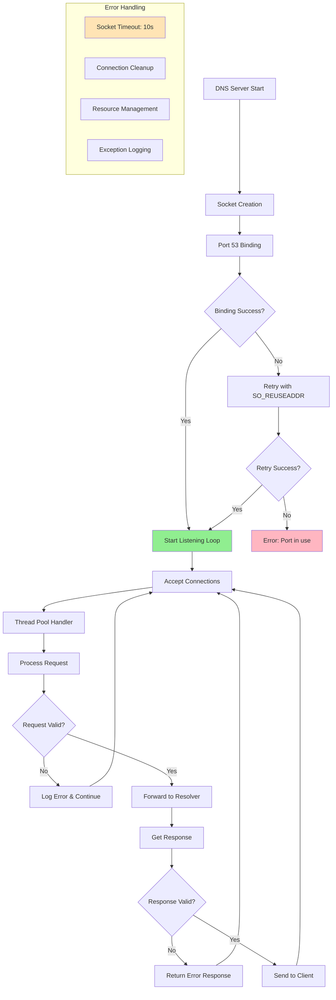

### 3.2 Comprehensive Testing

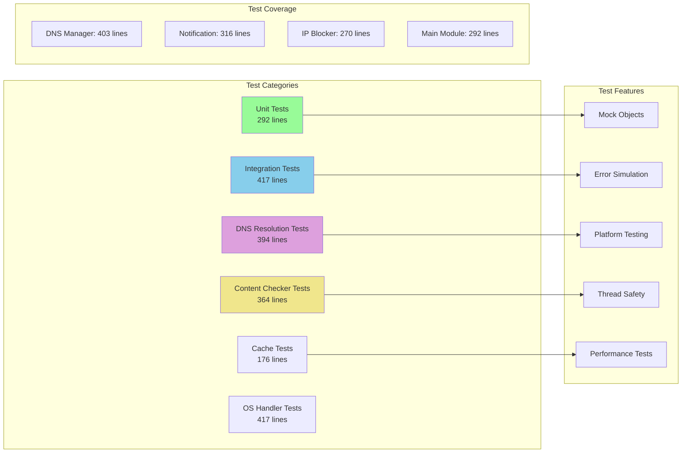

### 3.3 Cross-Platform Port Management

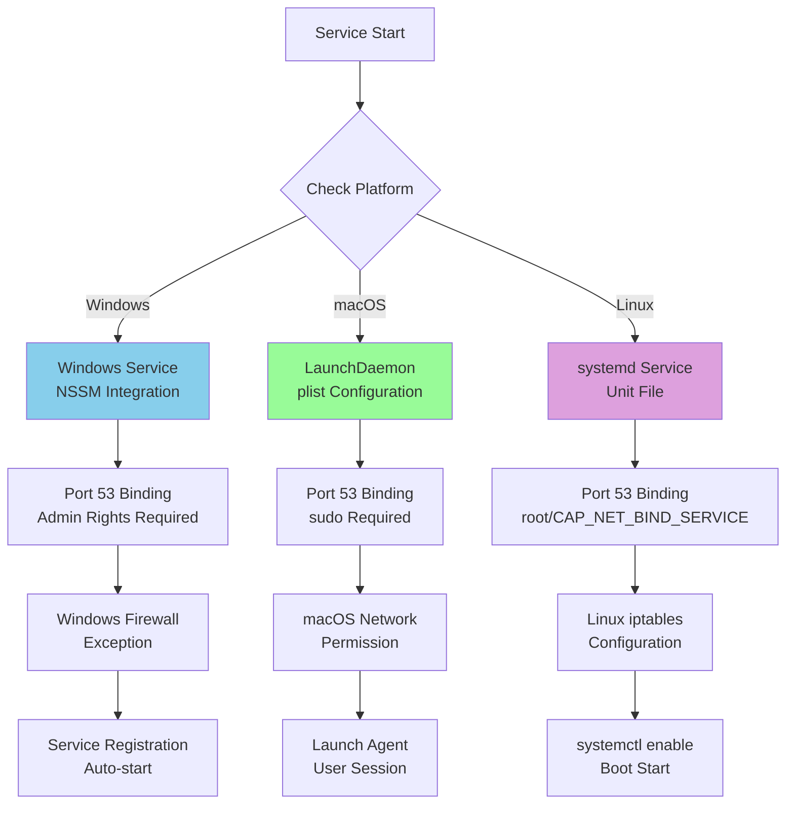

### 3.4 Watchdog & Health Monitoring

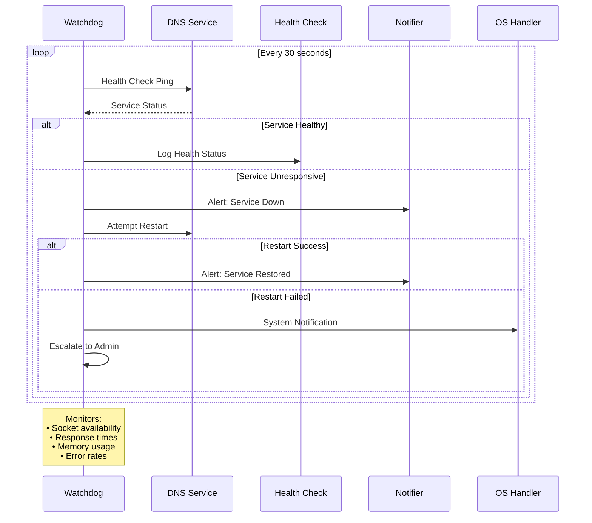

### 3.5 Fallback DNS Server Architecture

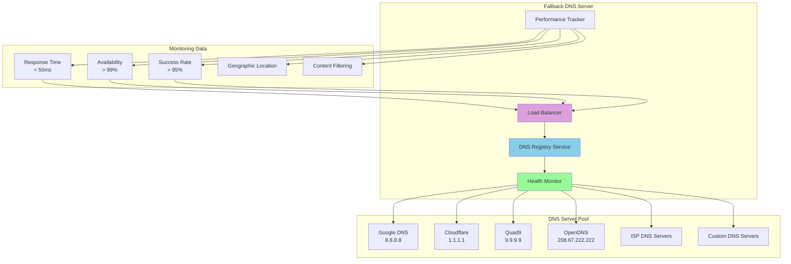

### 3.6 Fallback Mechanisms

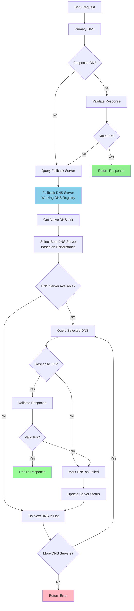

### 3.7 Automatic Network Restoration

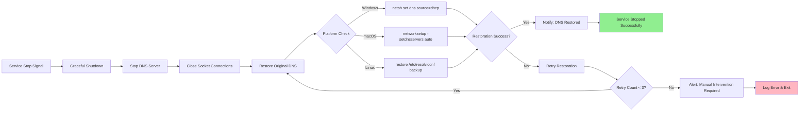

### 3.8 Advanced Cache Management

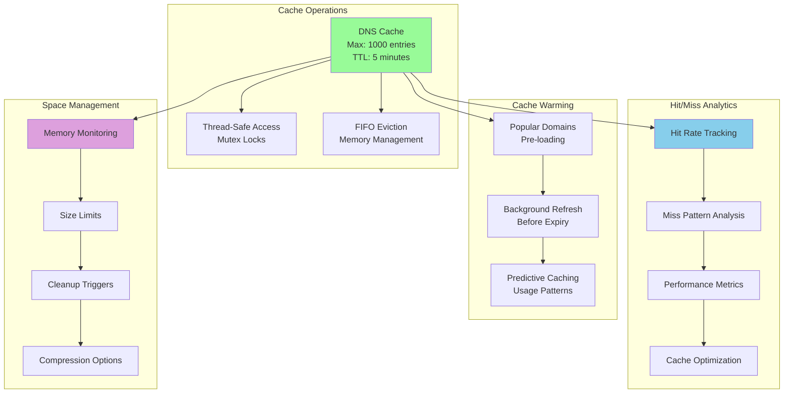

### 3.9 Docker Deployment (Future)

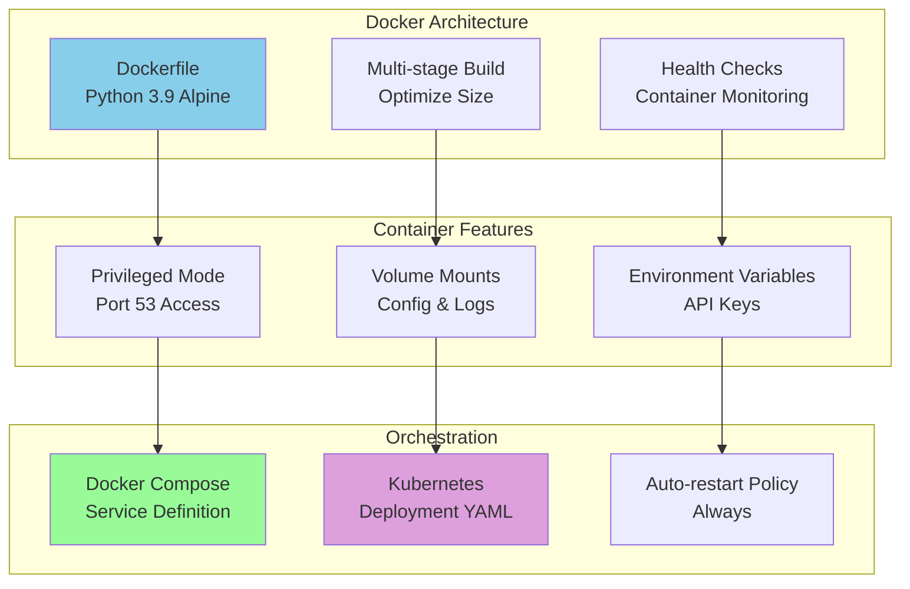

### 3.10 External Logging

```mermaid
flowchart LR
    A[DNY Service] --> B[Internal Logger]
    B --> C{Log Level}
    
    C -->|DEBUG| D[Debug.log]
    C -->|INFO| E[Info.log]
    C -->|WARNING| F[Warning.log]
    C -->|ERROR| G[Error.log]
    
    D --> H[Local File System]
    E --> H
    F --> H
    G --> H
    
    H --> I[Log Rotation<br/>Daily/Size-based]
    I --> J[Compressed Archives<br/>7-day retention]
    
    B --> K[External Syslog<br/>Optional]
    K --> L[Remote Log Server]
    K --> M[SIEM Integration]
    
    B --> N[Structured Logging<br/>JSON Format]
    N --> O[ELK Stack<br/>Elasticsearch]
    N --> P[Monitoring Tools<br/>Grafana]
    
    style B fill:#98FB98
    style H fill:#87CEEB
    style L fill:#DDA0DD
```

### 3.11 Disruption Handling & Recovery

```mermaid
sequenceDiagram
    participant S as DNY Service
    participant M as Monitor
    participant R as Recovery
    participant N as Notifier
    participant U as User
    
    S->>M: Regular Health Ping
    
    Note over S: Network Disruption Occurs
    
    M->>M: Detect Service Failure
    M->>R: Trigger Recovery Process
    
    R->>R: Analyze Failure Type
    
    alt Network Interface Down
        R->>R: Wait for Interface Recovery
        R->>S: Restart Service
    else DNS Port Conflict
        R->>R: Kill Conflicting Process
        R->>S: Rebind Port 53
    else System DNS Corruption
        R->>R: Restore DNS Backup
        R->>S: Reconfigure Service
    end
    
    R->>N: Recovery Status
    N->>U: "Service Restored"
    
    S->>M: Resume Health Pings
    
    Note over R: Recovery Strategies:<br/>• Automatic restart<br/>• Port conflict resolution<br/>• DNS configuration repair<br/>• Network interface recovery
```

---

## 4. KEY METRICS & PERFORMANCE

### Performance Indicators
- **DNS Resolution Time**: < 50ms average
- **Cache Hit Rate**: > 80% target
- **Service Uptime**: 99.9% availability
- **Memory Usage**: < 100MB footprint
- **Thread Pool**: 10 concurrent connections
- **Error Rate**: < 0.1% failed requests

### Robustness Features
- **Multi-platform Support**: Windows, macOS, Linux
- **Automatic Failover**: 3-tier DNS fallback
- **Self-healing**: Automatic service recovery
- **Comprehensive Testing**: 2,500+ lines of tests
- **Graceful Degradation**: Service continues with reduced features
- **Resource Management**: Automatic cleanup and optimization

---

*This presentation covers the complete DNY system architecture with emphasis on robustness, reliability, and cross-platform compatibility.* 